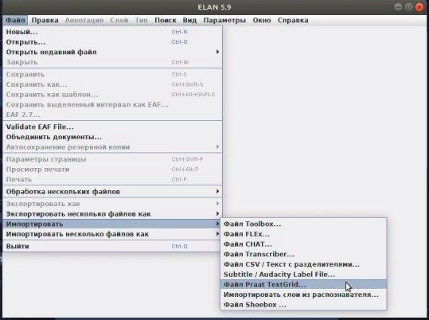
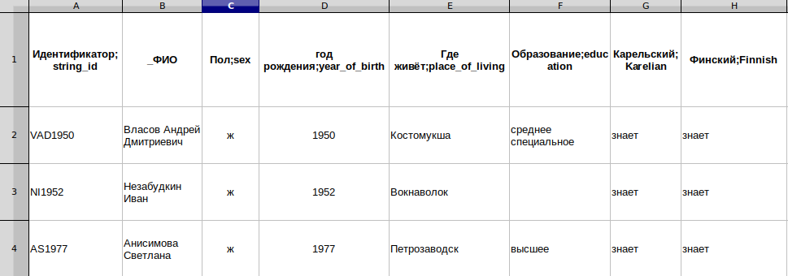

# Инструкция по подготовке данных для диалектного корпуса
Просим подробно ознакомиться со следующей инструкцией, так как несоответствие ей приведет к нарушению автоматизированного процесса создания корпуса. Как следствие, время создания/обновления данных корпуса увеличится. Данные должны быть предоставлены одной папкой на гугл-диске или любом другом облачном хранилище. Далее основная папка будет обозначаться как *главная_папка*

## 1. Аудио
0. Расположите аудиозаписи в директории *главная_папка/ENDVERSION*.
1. Аудиозаписи должны быть представлены в формате .wav (на данный момент другие форматы данных не поддерживаются платформой).
2. Расширение аудиозаписи должно быть записано строчными символами, вот так: .wav.
3. В названии аудиозаписи должны присуствовать только символы латиницы, цифры и нижнее подчеркивание.

## 2. Расшифровки
0. Расположите расшифровки к аудиозаписям в папке *главная_папка/ELAN-FILES*.
1. Расшифровки должны иметь расширение .eaf (элан). В случае, если расшифровка выполнена в формате .TextGrid, конвертируйте их в .eaf при помощи программы *Elan* (**Файл > Import** в основном окне программы). 
См. скриншот ниже:

В случае сложностей, обращайтесь по адресу [tito_alba@mail.ru]([tito_alba@mail.ru) (Лера Морозова)
2. Название расшифровок должно совпадать с названием аудиозаписи.
3. Слой с речью интервьюера должен быть назван строго **Interviewer** (это необходимо, чтобы речь интервьюера не учитывалась в статистике и не находилась по поисковым запросам). 
4. Допускается отсутствие расшифровок для частей записи. Например, в случае, если какие-то места записи содержат слишком личную информацию или неразборчива.

# 3. Метаданные информантов
0. Метаданные - сведения об информантах, участвовавших в записи корпуса корпуса, которые могут быть существенны в рамках лингвистических исследований.
1. Предоставление метаданных опционально - они могут быть использованы в поиске как дополнительные параметры. Если их нет, ничего страшного.
2. Отберите 3-6 признаков, существенных для поиска (рекомендуется: пол, год или десятилетие рождения, образование, проживание в селе) и сформируйте из них таблицу. Категоризуйте данные - то есть, приведите их к ограниченному набору значений. Например, в поле "образование" нужно писать строго "высшее, среднее и  т.п.", но не "закончил сельскую школу, затем пошел в училище". Состав набора значений не важен - следует исходить только из соображений удобства поиска.
3. Все остальные данные, которые хочется сохранить вместе с записями, но не использовать в поиске (например, личные данные или неструктурированные заметки) нужно вписывать в столбики с нижним подчеркиванием в начале названия (например, \_ФИО).
4. Сформируйте метаданные в виде таблицы, где:
- обязательно будет присутствовать столбик с названием "индекс;string_id" - сторбик с уникальным id информанта (обычно это инициалы ФИО + год рождения на латинице, например mav1955).
- каждый столбик - отдельный признак информанта. Формат названия столбика - русское_название_признака;английское_название_признака (например, образование;education). В строчке для каждого информанта записываются категоризованные значения признака.
- сохраните полученное таблицу в формате .xlsx, назовите ее *metadata.xlsx* и положите в корень *главной_папки*. 

Вот, например, фрагмент метаданных для карельского корпуса.

## Оформление корпуса
0. Данные для оформления корпуса расположите в директории *главная_папка/frontend*.
1. Фото для главной страницы корпуса - должно иметь хорошее качество, быть горизонтальным и желательно иметь темный оттенок. На фото не желательно присуствие людей, идеально - нейтральный пейзаж.
2. Структурированное описание для корпуса на русском и/или английском языках. Рекомендуется включить следующие сведения: где и когда были записаны тексты, кто их записывал, кто расшифровывал и проверял, кто руководил проектом; какая речь представлена в корпусе (какой диалект, являются ли говорящие носителями других языков). Можно упомянуть грант или организацию, которые поддерживали сбор текстов. Можно кратко охарактеризовать особенности идиома и / или сообщить об особенностях принятой в корпусе расшифровки, привести примеры расхождения между расшифровкой и реальным произношением. 

3. Обязательно укажите, как ссылаться на корпус в формате: 

*Если вы используете корпус в своей работе, пожалуйста, указывайте ссылку: Авторы. Название корпуса. Год выпуска корпуса. Москва: Международная лаборатория языковой конвергенции, НИУ ВШЭ. Электронный ресурс: [http://www.адрес_корпуса.ru](http://www.адрес_корпуса.ru)*

4. Допускаются отдельные пожелания и предложения по оформления корпуса.

__________________________________________
По любым сложностям и вопросам обращайтесь по адресу: [tito_alba@mail.ru]([tito_alba@mail.ru) (Лера Морозова)
